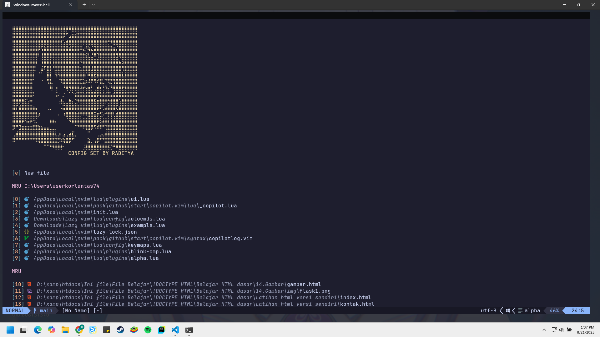

# Neovim My Own Lazy Config

My first own config for neovim from scratch.
## Contributors ✨

Thanks goes to these wonderful people ([emoji key](https://allcontributors.org/docs/en/emoji-key)):

<!-- ALL-CONTRIBUTORS-LIST:START - Do not remove or modify this section -->
<!-- ALL-CONTRIBUTORS-LIST:END -->

This project follows the [all-contributors](https://github.com/all-contributors/all-contributors) specification. Contributions of any kind welcome!

## NEOVIM
<p align="center">
  
</p>

## Update with Discord rich
<p align="center">
    
  </p>
  
## With terminal
<p align="center">
    
  </p>
  
## Copilot
<p align="center">
    
  </p>

## Requirments

- Neovim >= 0.9.0 (needs to be built with LuaJIT)
- Git >= 2.19.0 (for partial clones support)
- a Nerd Font(v3.0 or greater) (optional, but needed to display some icons)
- a C compiler for nvim-treesitter.
- ripgrep for telescope plugins.

## Installation

### Windows

- Make backup for current Neovim file.

```bash
# required
Move-Item $env:LOCALAPPDATA\nvim $env:LOCALAPPDATA\nvim.bak

# optional but recommended
Move-Item $env:LOCALAPPDATA\nvim-data $env:LOCALAPPDATA\nvim-data.bak
```

- Clone the project

```bash
git clone https://github.com/Raditya808/NEOVIM.git $env:LOCALAPPDATA\nvim
```

### Linux

- create backup for old config

```bash
# required
mv ~/.config/nvim{,.bak}

# optional but recommended
mv ~/.local/share/nvim{,.bak}
mv ~/.local/state/nvim{,.bak}
mv ~/.cache/nvim{,.bak}
```

- Git clone github repo

```bash
git clone https://github.com/Raditya808/NEOVIM.git ~/.config/nvim
```

- Start Neovim

```bash
nvim
```

# UPDATE WITH COPILOT

```bash
:Copilot set up (for login)
```

```bash
:Copilot enable (for activate copilot)
```
```bash
:Copilot disable (to disable)
```
```bash
:Copilot status (status)
```
```bash
:Copilot signout
```
